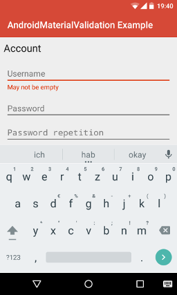

# AndroidMaterialValidation - README

[](https://android-arsenal.com/api?level=11) [](https://opensource.org/licenses/Apache-2.0) [](https://www.paypal.com/cgi-bin/webscr?cmd=_s-xclick&hosted_button_id=X75YSLEJV3DWE)

"AndroidMaterialValidation" is an Android-library, which provides custom views, which allow to be validated according to Android 5.0's Material Design guidelines even on pre-Lollipop devices. Additionally, various pre-defined validators are contained in the library.



The library provides the following features:

- The library provides a custom `EditText` implementation, which can be validated according to the Material Design guidelines.
- The library provides a custom `EditText` implementation, which can not only be validated according to the Material Design guidelines, but also allows to visualize the password strength, depending on customizable constraints.
- The library provides a custom `Spinner` implementation, which can be validated according to the Material Design guidelines.
- The library includes a large number of pre-defined validators, for example for validating phone numbers, e-mail addresses, domain names etc.

## License Agreement

This project is distributed under the Apache License version 2.0. For further information about this license agreement's content please refer to its full version, which is available at http://www.apache.org/licenses/LICENSE-2.0.txt.

Prior to version 2.0.1 this library was distributed under the GNU Lesser General Public License version 3.0 (GLPLv3).

## Download

The latest release of this library can be downloaded as a zip archive from the download section of the project's Github page, which is available [here](https://github.com/michael-rapp/AndroidMaterialValidation/releases). Furthermore, the library's source code is available as a Git repository, which can be cloned using the URL https://github.com/michael-rapp/AndroidMaterialValidation.git.

Alternatively, the library can be added to your Android app as a Gradle dependency by adding the following to the respective module's `build.gradle` file:

```groovy
dependencies {
    compile 'com.github.michael-rapp:android-material-validation:2.0.6'
}
```

Before version 2.0.0 this project was hosted on [Sourceforge](https://sourceforge.net/projects/androidmaterialvalidation). These older versions used the legacy Eclipse ADT folder structure and are not available as Gradle artifacts.

## Examples

The following examples provide a quick overview on how to use the views, which are provided by the library, in your own Android app. This project also contains the source code of an example app, which implements an use case of the library for demonstration purposes, as well as a more detailed documentation in the [Wiki](https://github.com/michael-rapp/AndroidMaterialValidation/wiki) and auto-generated javadoc files.

### EditText

The XML code below shows how to declare an `EditText` widget within a XML layout resource. The example contains all of the view's custom attributes.

```xml
<?xml version="1.0" encoding="utf-8"?> 
<RelativeLayout xmlns:android="http://schemas.android.com/apk/res/android" 
    xmlns:custom="http://schemas.android.com/apk/res-auto" 
    android:layout_width="match_parent" 
    android:layout_height="match_parent" >

    <de.mrapp.android.validation.EditText 
        android:id="@+id/edit_text" 
        android:layout_width="match_parent" 
        android:layout_height="wrap_content" 
        android:hint="@string/edit_text_hint" 
        android:hintColor="@color/hint_color" 
        custom:helperText="@string/edit_text_helper_text" 
        custom:helperTextColor="@color/helper_text_color" 
        custom:errorColor="@color/error_color" 
        custom:validateOnValueChange="true" 
        custom:validateOnFocusLost="true" 
        custom:maxNumberOfCharacters="120" /> 

</RelativeLayout>
```

The Java code below shows how to add validators to an `EditText` widget. The validators have to be added programmatically, regardless of whether the view has been created via XML or programmatically. Therefore, if the view has been created via a XML resource, like shown above, it has to be referenced first using an activity's or parent view's `findViewById`-method.

```java
EditText editText = (EditText) findViewById(R.id.edit_text); 
editText.addValidator(Validators.notEmpty(this, R.string.not_empty_error_message); 
editText.addValidator(Validators.number(this, R.string.number_error_message);
```

### PasswordEditText

The following XML code shows how a `PasswordEditText` can be declared within a XML layout resource. The example contains all of the view's custom attributes.

```xml
<?xml version="1.0" encoding="utf-8"?> 
<RelativeLayout xmlns:android="http://schemas.android.com/apk/res/android" 
    xmlns:custom="http://schemas.android.com/apk/res-auto" 
    android:layout_width="match_parent" 
    android:layout_height="match_parent" >

    <de.mrapp.android.validation.PasswordEditText 
        android:id="@+id/password_edit_text" 
        android:layout_width="match_parent" 
        android:layout_height="wrap_content" 
        android:hint="@string/password_edit_text_hint" 
        android:hintColor="@color/hint_color" 
        custom:helperText="@string/password_edit_text_helper_text" 
        custom:helperTextColor="@color/helper_text_color" 
        custom:errorColor="@color/error_color" 
        custom:validateOnValueChange="true" 
        custom:validateOnFocusLost="true" 
        custom:passwordVerificationPrefix="Password strength" /> 

</RelativeLayout>
```

The Java code below shows how to add validators and constraints to a `PasswordEditText` widget. The validators and constraints have to be added programmatically, regardless of whether the view has been created via XML or programmatically. Therefore, if the view has been created via a XML resource, like shown above, it has to be referenced first using an activity's or parent view's `findViewById`-method.

```java
PasswordEditText passwordEditText = (PasswordEditText) findViewById(R.id.password_edit_text); 
passwordEditText.addValidator(Validators.minLength(this, R.string.min_length_error_message, 4); 
passwordEditText.addValidator(Validators.noWhitespace(this, R.string.no_whitespace_error_message); 
passwordEditText.addAllConstraints(Constraints.minLength(10), Constraints.containsLetter(), 
    Constraints.containsNumber(), Constraints.containsSymbol()); 
passwordEditText.addAllHelperTexts("Bad", "Low", "Sufficient", "Good", "High"); 
passwordEditText.addAllHelperTextColorIds(R.color.black, R.color.red, R.color.orange, 
    R.color.light_green, R.color.dark_green);
```

## Spinner

The following example shows how a `Spinner` can be declared within a XML layout resource. The example contains all of the view's custom attributes.

```xml
<?xml version="1.0" encoding="utf-8"?> 
<RelativeLayout xmlns:android="http://schemas.android.com/apk/res/android" 
    xmlns:custom="http://schemas.android.com/apk/res-auto" 
    android:layout_width="match_parent" 
    android:layout_height="match_parent" >
        
    <de.mrapp.android.validation.Spinner
        android:id="@+id/spinner"
        android:layout_width="match_parent"
        android:layout_height="wrap_content"
        android:entries="@array/spinner_entries"
        android:hint="@string/spinner_hint"
        android:textColorHint="@color/spinner_text_color_hint"
        android:dropDownHorizontalOffset="@dimen/spinner_drop_down_horizontal_offset"
        android:dropDownVerticalOffset="@dimen/spinner_drop_down_vertical_offset"
        custom:dropDownWidth="@dimen/spinner_drop_down_width"
        custom:popupBackground="@color/spinner_drop_down_background"
        custom:prompt="@string/spinner_prompt" />
        
</RelativeLayout>
```

The Java code below shows how to add validators to a `Spinner` widget. The validators and must be added programmatically, regardless of whether the view has been created via XML or programmatically. Therefore, if the view has been created via a XML resource, like shown above, it has to be referenced first using an activity's or parent view's `findViewById`-method.

```java
Spinner spinner = (Spinner) findViewById(R.id.spinner);
spinner.addValidator(Validators.notNull(this, R.string.not_null_validator_error_message);
```

## Contact information

For personal feedback or questions feel free to contact me via the mail address, which is mentioned on my [Github profile](https://github.com/michael-rapp). If you have found any bugs or want to post a feature request please use the [bugtracker](https://github.com/michael-rapp/AndroidMaterialValidation/issues) to report them.
